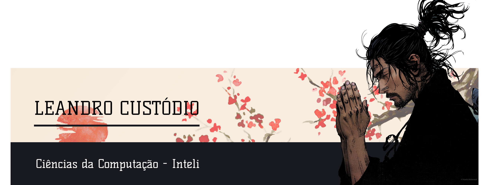

  <a href="https://github.com/LPHBackspace">
  
  
  

 

 
  
  
  
  
  
  
  
  

##

   
  
  
 
  
  
##
    
    
- 🎂 Nascido em 18/01/2002    
- 📘 Graduação em Ciência da Computação na INTELI  | 2022 - 2025
- 📘 Estudante de Java no Instituto PROA | 2021
- 🏡 Técnico em Edificações pela Etec Itaquera II | 2018-2020 - Ensino Técnico Integrado ao Médio
- 📨 Você pode entrar em contato comigo pelo e-mail: leandro.custodio@sou.inteli.edu.br
- 👨‍💻 Link para <a href="https://lphbackspace.github.io/site_curriculo/public/index.html">curículo virtual</a>
  
    
  
  ##
